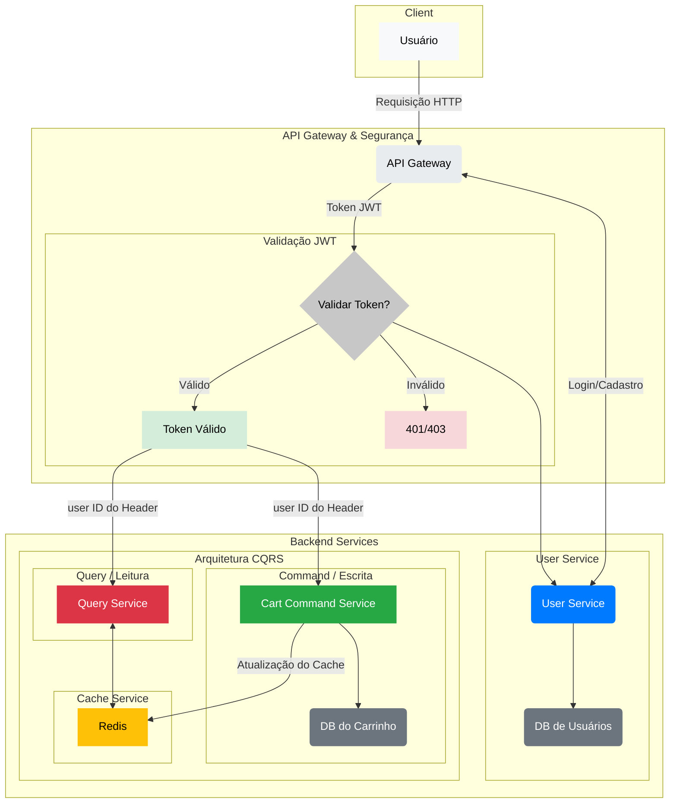

# Microservices Shopping Cart Application

This project is a microservices-based E-commerce Shopping Cart application. It is built using Spring Boot and follows the CQRS (Command Query Responsibility Segregation) pattern for high performance and scalability. The application is designed to be run and orchestrated with a single `docker-compose up` command.

## Architecture

The application is composed of the following microservices, each with a specific responsibility:

* **API Gateway**: A central entry point for all client requests. It handles authentication and routing to the appropriate backend service.

* **User Service**: Manages customer registration, login, and authentication with JWT (JSON Web Token).

* **Cart Command Service (Write Model)**: Manages all operations that change a user's cart state, such as adding or removing items.

* **Cart Query Service (Read Model)**: Provides a fast, read-only view of a user's current shopping cart summary and items.

## Technology Stack

* **Backend**: Java, Spring Boot 3.1.4
* **API Management**: Spring Cloud Gateway, Netflix Eureka
* **Persistence**: PostgreSQL (independent per-service databases for users and cart commands) and Redis (for fast read caching)
* **Containerization**: Docker and Docker Compose
* **Security**: Spring Security and JWT

## Endpoints

The following endpoints are available. The Postman collection provided can be used to test the complete flow.

### User Management

* `POST /users/register`: Registers a new customer.
    * **Body**: `{"fullName": "string", "documentNumber": "string", "login": "string", "password": "string"}`

* `POST /users/login`: Authenticates a customer and returns a JWT token.
    * **Body**: `{"login": "string", "password": "string"}`

### Cart Management (CQRS)

* `POST /cart/add-item`: Adds an item to the shopping cart. **Requires JWT.**
    * **Body**: `{"productId": "string", "quantity": 1, "price": 100.00}`

* `POST /cart/remove-item`: Removes an item from the shopping cart. **Requires JWT.**
    * **Body**: `{"productId": "string", "quantity": 1, "price": 100.00}`

* `GET /cart`: Retrieves the customer's current cart summary and added items. **Requires JWT.**

## Getting Started

1.  **Clone the repository**: `git clone <repository-url>`
2.  **Navigate to the project directory**: `cd <project-name>`
3.  **Run the application**: `make all` (Builds Maven and starts Docker Compose)
4.  The application will be accessible at `http://localhost:8080`.

## Testing

A Postman collection is included in the project (`postman/`) to help you test the authentication and shopping cart flows automatically.

## Contact Me 👋

Linkedin: [Angela Soler](https://www.linkedin.com/in/angela-soler-caro)

## Reference Links

* [Spring Cloud Projects](https://spring.io/projects/spring-cloud)
